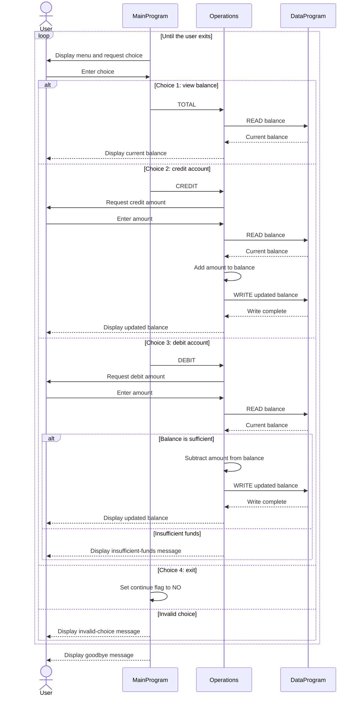

# COBOL Account Management

## Overview

The COBOL program provides a console menu for viewing and changing an account balance. `MainProgram` handles user interaction, `Operations` performs the requested transaction, and `DataProgram` stores and returns the balance.

Despite the exercise's student-account context, the current implementation models only one account. It has no student identifiers, student records, or per-student balances.

## Source Files

### `src/cobol/main.cob`

Defines `MainProgram`, the application entry point. It repeatedly displays the account menu, accepts a choice, and calls `Operations` to view the balance, credit the account, or debit the account. Choosing 4 exits; other choices display an invalid-choice message.

### `src/cobol/operations.cob`

Defines `Operations`, which handles the three account actions:

- `TOTAL`: reads and displays the current balance. The operation value is padded to six characters.
- `CREDIT`: accepts an amount, reads the balance, adds the amount, writes the updated balance, and displays it.
- `DEBIT`: accepts an amount, reads the balance, and subtracts and saves the amount only when sufficient funds are available. Otherwise, it reports insufficient funds. The operation value is padded to six characters.

### `src/cobol/data.cob`

Defines `DataProgram`, the balance storage interface. Its working-storage balance starts at `1000.00`. A `READ` operation copies that value to the caller; a `WRITE` operation replaces it with the caller's value. The storage is in memory, so the program does not save account changes to a file or database.

## Account Rules in the Current Implementation

- The starting balance is `1000.00`.
- A credit adds the entered amount to the balance.
- A debit is accepted when the balance is greater than or equal to the entered amount; otherwise, the balance is unchanged and an insufficient-funds message is shown.
- No explicit checks enforce positive amounts, credit limits, student eligibility, or other student-specific policies.
- All transactions affect the same account balance; there is no account selection or student-level separation.

## Application Data Flow

